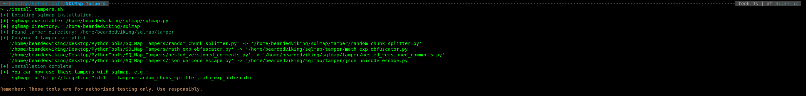

<p align="center">
  
</p>

# 🛡️ SQLMap Tampers – Bearded Viking Security Forge

> **Advanced sqlmap tamper scripts for modern WAF bypass – JSON Unicode escapes, mathematical obfuscation, nested versioned comments, and random keyword splitting. Continuously updated. For authorised security testing only.**

[](https://opensource.org/licenses/MIT)
[](https://github.com/BeardedVikingTX/SQLMap_Tampers/commits/main)

---

## 📦 What’s Inside

| Tamper Script | Description |
|---------------|-------------|
| **`json_unicode_escape.py`** | Fully fledged JSON obfuscator: Unicode/hex/octal escapes, random case, whitespace tricks, JSON/array wrapping, junk injection, and comment fragmentation – all configurable. |
| **`math_exp_obfuscator.py`** | Replaces every integer literal with a random, DBMS‑aware mathematical expression (trig, log, bitwise, etc.) drawn from 100+ templates. |
| **`nested_versioned_comments.py`** | Wraps SQL keywords in deeply nested MySQL versioned comments (`/*!50727...*/`) with random hex/base64 padding – up to 5 levels deep, with multiple DBMS fallbacks. |
| **`random_chunk_splitter.py`** | Splits SQL keywords into 2–4 fragments, inserting inline or versioned comments between them – randomness per request to defeat signature‑based WAFs. |

> **More tampers are in active development** – watch this space!

---

## 🚀 Installation (One‑Click)

We’ve made it dead simple to install all tampers into your sqlmap environment.

1. Clone the repo:
```
   git clone https://github.com/BeardedVikingTX/SQLMap_Tampers.git
   cd SQLMap_Tampers
```
2. Run the installer:
```
chmod +x install_tampers.sh
./install_tampers.sh
```
_Optionally, backup existing tampers:_
```
./install_tampers.sh --backup
```
_To copy all `.py` files in the directory:_
```
./install_tampers.sh --all
```
3. Verify they’re installed:
```
sqlmap --list-tampers | grep -E "(json_unicode_escape|math_exp_obfuscator|nested_versioned_comments|random_chunk_splitter)"
```
**Success!** Here’s what it looks like when the script does its magic:
<p align="center"> 
   
</p>

## 🎯 Usage Examples
Once installed, use them individually or in combination:
```
# Single tamper
sqlmap -u "http://target.com?id=1" --tamper=json_unicode_escape

# Stack multiple tampers (order matters)
sqlmap -u "http://target.com?id=1" \
       --tamper=json_unicode_escape,math_exp_obfuscator,nested_versioned_comments,random_chunk_splitter

# With other built‑in tampers
sqlmap -u "http://target.com?id=1" \
       --tamper=json_unicode_escape,space2comment,randomcase
```

## 🧠 Why These Tampers?
* **SON APIs** – the `json_unicode_escape` tamper deals with the quirks of JSON parsers and WAFs that don’t handle Unicode escapes correctly.
* **WAF evasion** – our tampers combine multiple layers (math obfuscation, comment nesting, keyword fragmentation) to bypass even advanced WAFs.
* **DBMS awareness** – scripts detect the backend and adapt (MySQL, PostgreSQL, MSSQL, Oracle) so they never break your SQL.
* **Randomisation** – each request is unique; signature‑based detection becomes ineffective.

## 🔧 Customisation
For the JSON tamper (`json_unicode_escape.py`), edit the `SETTINGS` dict at the top to enable/disable individual techniques:
```
SETTINGS = {
    'unicode_escape': True,
    'hex_escape': False,
    'random_case': True,
    'json_wrap': True,
    # ... etc.
}
```

# ⚠️ Disclaimer
***Use these tools only on systems you own or have explicit written permission to test.***
_The author (Bearded Viking / Bearded Viking Security Forge) assumes **no liability** for any misuse or damage caused by these scripts. They are provided "AS IS" without warranty of any kind._

# 📜 License
This project is licensed under the MIT License – see the [LICENSE.md[(LICENSE.md) file for details.

# 👨‍💻 About the Author

<p align="center>
  
</p>

**Bearded Viking** (BeardedVikingTX) – Security researcher, penetration tester, and open‑source contributor.  
* 🌐 [Web](https://beardedviking.org)  
* 🎥 [TikTok](https://www.tiktok.com/@beardedvikingtx)  
* 👨‍💻 [LinkedIn](https://www.linkedin.com/in/bearded-viking-3112a8431/)  
* 📘 [Facebook](https://www.facebook.com/BeardedVikingTX)  
* ✒️ [Medium](https://beardedviking.medium.com/)  

# 🧩 Stay Tuned
We’re constantly adding new tampers and enhancing existing ones.
Star ⭐ the repo to stay updated, and feel free to open issues or PRs with your own ideas!
<p align="center"> 
   
</p>

**Happy (`ethical`) hacking! 🛡️**
